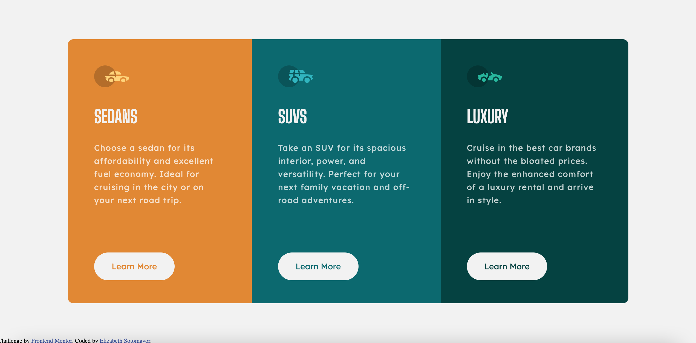

# Frontend Mentor - 3-column preview card component solution

This is a solution to the [3-column preview card component challenge on Frontend Mentor](https://www.frontendmentor.io/challenges/3column-preview-card-component-pH92eAR2-). Frontend Mentor challenges help you improve your coding skills by building realistic projects. 

## Table of contents

- [Overview](#overview)
  - [The challenge](#the-challenge)
  - [Screenshot](#screenshot)
  - [Links](#links)
- [My process](#my-process)
  - [Built with](#built-with)
  - [What I learned](#what-i-learned)
  - [Continued development](#continued-development)
  - [Useful resources](#useful-resources)
- [Author](#author)

## Overview

### The challenge

Users should be able to:

- View the optimal layout depending on their device's screen size
- See hover states for interactive elements

### Screenshot

### Links

- Solution URL: [Add solution URL here](https://your-solution-url.com)
- Live Site URL: [Add live site URL here](https://your-live-site-url.com)

## My process

### Built with

- Semantic HTML5 markup
- CSS custom properties
- Flexbox
- CSS Grid

### What I learned

I completed this project using CSS grid and flexbox. The first challenge was deciding between flex and grid to create the layout. I sketched out the layout and decided to use grid for the body and a flex container for all the cards. Each card was then given its own separate div with a base class of "card" and a respective class for each type of vehicle that could then be customized according to the specifications. I consulted the design multiple times so hope the width/padding is accurate. I had some trouble with getting the text to line up properly since it kept overflowing to the next line, so I used letter spacing to even things out.

### Continued development

I want to continue working with CSS grid and try making different layout patterns with it.

### Useful resources

- [CSS-Tricks A Complete Guide to Grid](https://css-tricks.com/snippets/css/complete-guide-grid/) - An excellent resource for working with CSS grid that includes every property.
- [W3 Schools CSS border-bottom-left-radius](https://www.w3schools.com/cssref/css3_pr_border-bottom-left-radius.asp) - This helped me understand changing the border radius on only one side of a div.

## Author

- Website - [Elizabeth Sotomayor](elizabethrsotomayor.github.io/somyo2)
- Frontend Mentor - [@elizabethrsotomayor](https://www.frontendmentor.io/profile/elizabethrsotomayor)
- Twitter - [@lahijadelmar_](https://twitter.com/lahijadelmar_)
